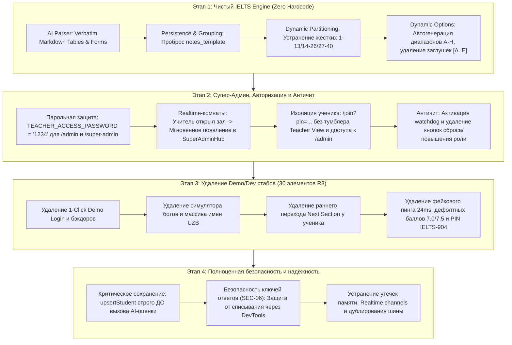

# Комплексный генеральный план рефакторинга платформы CD IELTS (4 этапа)

Настоящий план разработан на основе отчёта полного технического аудита (`AUDIT_REPORT.md`, 77 выявленных дефектов) и архитектурных инвариантов стандарта Cambridge Computer-Based IELTS (`cd-ielts-development`).

---

## Общие принципы выполнения

1. **Строгая последовательность:** Работы выполняются поэтапно: **Этап 1 → Этап 2 → Этап 3 → Этап 4**. Переход к следующему этапу происходит только после завершения и валидации предыдущего.
2. **Изоляция общих модулей:** Никакой параллельной перезаписи общих файлов (`App.jsx`, `supabase.js`, `ListeningSection.jsx`). Изменения вносятся точечно и аккуратно в рамках активного этапа.
3. **Прогрессивная валидация:** После каждого этапа проверяется синтаксис JSX/JS через esbuild/node (без запуска `npm run build`), а также инспектируется `git status` и `git diff --stat`.



---

## ЭТАП 1. Устранение хардкода и 100% совместимость с Cambridge IELTS

### Цель
Обеспечить универсальную сборку и рендеринг любого экзаменационного буклета Cambridge IELTS (Reading, Listening, Writing) любой сложности без потери нередактируемых строк, искажения табличной сетки и жестких привязок к номерам вопросов.

### 1.1. Исправление потери статических строк и многоколоночных таблиц (Баги 1 и 2)
- **AI Parser (`src/lib/ai/gemini-service.js`):**
  - В `LISTENING_PARSER_CONFIG` и `parseListeningPdf` внедрить строгое требование для `TABLE_COMPLETION`: формировать валидную Markdown-таблицу (`| Col 1 | Col 2 | ... |`) в `notes_template`, содержащую **все** колонки и строки оригинала verbatim. Если несколько вопросов находятся в одной строке (например, Q25 в колонке 1 и Q26 в колонке 3), они обязаны оставаться в одной строке таблицы. Все статические ячейки без ввода (`recording them`, `talking to tutor` и др.) сохраняются.
  - Для `FORM_COMPLETION`: формировать полный текст формы в `notes_template` с заголовками (`Personal details`) и всеми информационными статическими строками (`Where property required: Birmingham`, `Name: Kevin Walker`, `Maximum rent: £650 a month`).
- **Сборка и сохранение экзамена (`src/components/admin/TestCreator.jsx`):**
  - В `listeningPartsPayload` (строки 945–978) добавить гарантированный проброс:
    `notes_template: listeningParsed?.parts?.[idx]?.notes_template || listeningParsed?.sections?.[idx]?.notes_template || ''`, а также `instruction`, `reference_box`, `table_template`.
  - При раскладке вопросов привязывать `notes_template` к каждому вопросу соответствующей группы.
- **Группировка вопросов (`src/lib/questionUtils.js`):**
  - В `groupQuestionsIntoSets`: если у первого вопроса `summaryTemplate` отсутствует, брать fallback из `currentPart.notes_template` или `currentPart.table_template`.
- **Рендерер студента (`src/components/student/ListeningSection.jsx`):**
  - В ветке `TABLE_COMPLETION` при наличии Markdown-таблицы (содержит символ `|`) рендерить её через `<MarkdownTable />` из `IeltsBookletRenderer.jsx`.
  - В ветке `FORM_COMPLETION` рендерить форму целиком через `renderNotesTemplate` при наличии `tplKey`, отображая статический текст без искажений.

### 1.2. Устранение фиксированного партиционирования вопросов (R1.1, R1.2, R1.3)
- **Файл:** `src/lib/pdfParser.js`
- **Проблема:**
  - Reading: Пассаж 1 = 1–13, Пассаж 2 = 14–26, Пассаж 3 = 27–40. Во многих тестах Cambridge распределение иное: 1–14, 15–27, 28–40! В результате вопросы пассажа 1 попадают в таб пассажа 2.
  - Listening: Деление строго по модулю 10 (1–10, 11–20, 21–30, 31–40).
  - Жесткое отсечение диапазоном `1 <= qNum <= 40`.
- **Решение:**
  - Определять границы пассажей и частей по маркерам `READING PASSAGE 1 / 2 / 3` и `SECTION 1 / PART 2 / PART 3 / PART 4` в AST-потоке текста.
  - Привязывать вопросы к пассажу/части по их фактическому положению в документе, а не по арифметическому номеру вопроса.

### 1.3. Ликвидация генераторов фейковых вопросов (R1.4, R1.5)
- **Файлы:** `src/lib/pdfParser.js#L236-L249`, `src/components/student/AnswerSheet.jsx#L94-L108`.
- **Проблема:** Если в пассаже не найдены вопросы, `AnswerSheet.jsx` на лету синтезирует 10 вымышленных вопросов `FILL_BLANK` вида `Question 1: Complete the answer from the text`, а `pdfParser` генерирует 10 пустышек.
- **Решение:** Удалить генерацию фейковых вопросов. Если вопросов нет — отображать чистое состояние загрузки или сообщение об отсутствии вопросов в секции.

### 1.4. Динамические варианты ответов и опции (R1.14 – R1.18)
- **Файлы:** `src/components/student/AnswerSheet.jsx`, `src/components/student/ListeningSection.jsx`, `src/components/student/PassageViewer.jsx`.
- **Проблема:**
  - При отсутствии вариантов в matching исследователей подставляется жесткий массив `['A', 'B', 'C', 'D']` или ограничивается регуляркой `[A-G]`. В Cambridge 16 Test 3 список ученых доходит до `A-H`.
  - В вопросах «Choose TWO» и MCQ при отсутствии опций генерируются 5 пустых кнопок `[A] [B] [C] [D] [E]` без текста.
  - `PassageViewer.jsx` ограничивает разметку параграфов буквами A–M (максимум 13 параграфов).
- **Решение:**
  - Разрешать опции из `group.referenceBox` или текста задания. Если текст опций отсутствует, направлять кандидата к блоку вариантов в тексте буклета, не рисуя пустые кнопки.
  - Заменить жесткий массив параграфов на динамический генератор `String.fromCharCode(65 + i)`.

### 1.5. Удаление захардкоженных текстов и тем тестов (R1.8 – R1.12)
- **Файлы:** `src/lib/mockData.js`, `src/components/student/WritingSection.jsx`.
- **Проблема:** В коде зашиты статичные эссе («Колизей / Flavian Amphitheatre», «Диагностика ИИ», «Биомимикрия»), темы Writing Task 1 («Renewable energy sources in 4 countries») и Task 2 («AI automation and unemployment»).
- **Решение:** Очистить дефолтные тексты. Все промпты и пассажи должны поступать исключительно из загруженного буклета или базы данных Supabase.

---

## ЭТАП 2. Настройка Супер-Админа, Авторизации и Античита

### Цель
Внедрить надёжный локальный парольный доступ к административным панелям, мгновенную синхронизацию экзаменационных залов между учителем и супер-админом через Supabase Realtime, изолировать кандидата от административного интерфейса и запустить полноценный античит.

### 2.1. Парольная защита панели Учителя и панели Супер-Админа
- **Файлы:** `src/App.jsx`, `src/components/Navbar.jsx`, `src/components/superadmin/SuperAdminHub.jsx`, `src/components/superadmin/SuperAdminLogin.jsx`, `src/components/admin/AdminPasswordModal.jsx` (новый легковесный компонент).
- **Архитектурное решение:**
  1. Вынести константу пароля административного доступа:
     ```javascript
     export const TEACHER_ACCESS_PASSWORD = '1234';
     ```
  2. Защитить вход в:
     - Панель Учителя (`/admin`, вкладка «Teacher View»);
     - Панель Супер-Админа (`/super-admin`).
  3. Если в текущей сессии (`sessionStorage.getItem('ielts_admin_authenticated') !== 'true'`) пароль не был введён:
     - При попытке переключиться на «Teacher View» или открыть `/admin` / `/super-admin` открывается аккуратное модальное окно ввода пароля.
     - При вводе правильного пароля (`1234`) доступ подтверждается на время сессии вкладки.
     - При неверном вводе отображается понятная ошибка, доступ блокируется.
  4. Удалить из `Navbar.jsx` открытый неконтролируемый доступ к панели учителя.

### 2.2. Изоляция ученика и ссылка `/join?pin=...`
- **Файлы:** `src/App.jsx`, `src/components/Navbar.jsx`.
- **Решение:**
  1. Роль по умолчанию при первой загрузке приложения — строго `'student'`.
  2. Для ученика, открывшего прямую ссылку `${window.location.origin}/join?pin=XYZ`:
     - В `Navbar.jsx` **полностью скрывается** тумблер переключения ролей («Teacher View / Student View»). Ученик не должен даже видеть намёка на существование панели учителя.
     - Любая ручная смена URL (переход на `/`, `/admin`, `/super-admin`) блокируется роут-гардом: ученик редиректится на `/join?pin=XYZ` или экран сдачи теста.

### 2.3. Realtime-синхронизация комнат (Учитель → Супер-Админ)
- **Файлы:** `src/components/superadmin/SuperAdminHub.jsx`, `src/lib/superAdminService.js`.
- **Решение:**
  1. При создании или открытии лобби учителем (`status: 'lobby'`, `is_lobby_open: true`) данные моментально фиксируются в Supabase в таблице `exams`.
  2. В `SuperAdminHub.jsx` наладить активную подписку:
     ```javascript
     const channel = supabase
       .channel('superadmin_exams_realtime')
       .on('postgres_changes', { event: '*', schema: 'public', table: 'exams' }, (payload) => {
         handleExamRealtimeUpdate(payload);
       })
       .subscribe();
     ```
  3. Карточка открытой комнаты мгновенно появляется в списке активных залов Супер-Админа в реальном времени (название теста, PIN-код, статус, число подключенных студентов).
  4. Удалить мок `DEFAULT_TEACHERS` и статическую сессию `IELTS-904` — отображать живые комнаты из базы.

### 2.4. Активация Античита и вырезка бэкдоров (R4.3, STUB-07, STUB-08)
- **Файлы:** `src/components/student/StudentExamRoom.jsx`, `src/components/student/AntiCheatOverlay.jsx`.
- **Решение:**
  1. **Активация слежения (R4.3):**
     - В `StudentExamRoom.jsx#L495` передать обязательный проп:
       `isExamActive={Boolean(currentStage && currentStage.endsWith('_active'))}`.
     - В `AntiCheatOverlay.jsx` перевести слушатель события `visibilitychange` на `document` (вместо `window`), гарантируя 100% срабатывание при сворачивании окна или переключении вкладки.
  2. **Удаление кнопок обхода (STUB-07, STUB-08):**
     - Полностью удалить из `AntiCheatOverlay.jsx`:
       - Кнопку «🔄 Войти заново / Сбросить кандидата» (позволяла читеру стереть `localStorage` и зайти заново);
       - Кнопку «👨‍🏫 Перейти в панель Учителя (Teacher View)» (позволяла читеру переключить себя в роль учителя).
     - Дисквалификация является окончательной, флаг нарушения передаётся проктору в реальном времени.

---

## ЭТАП 3. Полное удаление функций быстрого демо (30 стабов R3)

### Цель
Полностью изъять из кодовой базы все вспомогательные тестовые функции, демо-кнопки, хардкодные учетные записи, ботов-симуляторов и обходные пути, каталогизированные в `AUDIT_REPORT.md`.

### 3.1. Ликвидация Super-Admin демо-входа и бэкдоров (STUB-01 – STUB-04)
- **Файлы:** `src/lib/superAdminService.js`, `src/components/superadmin/SuperAdminLogin.jsx`.
- Удалить хардкод: `admin@ielts-master.org` / `SuperAdmin2026!`.
- Удалить кнопку «1-Click Demo Super-Admin Login».
- Удалить фейковый токен `demo-superadmin-token-` и инъекцию в `localStorage`.
- Удалить уязвимость `user.email?.includes('superadmin')`. Вход супер-админа — через пароль `TEACHER_ACCESS_PASSWORD` или реальный Supabase Auth.

### 3.2. Удаление симулятора ботов и фейковых учеников (STUB-15, STUB-16, STUB-17)
- **Файлы:** `src/App.jsx#L612-L710`, `src/App.jsx#L835-L876`, `src/components/admin/LiveLobby.jsx#L140-L161`.
- Удалить активный фоновый таймер `setInterval` в `App.jsx`, вбивавший фиктивные ответы (`"harrington"`, `"078923411"`, `"travertine"`).
- Удалить функции `handleAddMockStudents` и массив узбекских имен (`Azizbek Kobilov` и др.) с префиксом `UZB-`.
- Удалить кнопки «+ Add 2 Test Student Bots» и «Add Simulated Candidates» из лобби учителя.

### 3.3. Удаление автозаполнения и быстрого демо ученика (STUB-10, STUB-11, STUB-13)
- **Файл:** `src/components/student/StudentJoin.jsx`.
- Удалить обработчик `handleQuickDemo` и кнопку «Auto-fill Test Profile» на экране входа студента.
- Удалить оффлайн-обход входа без проверки PIN в Supabase.

### 3.4. Удаление раннего завершения секций кандидатом (STUB-14)
- **Файл:** `src/components/student/StudentExamRoom.jsx#L366-L374`.
- Удалить кнопку «Next Section / Submit Section» у кандидата во время активной фазы Listening и Reading. Переход секций происходит строго по таймеру или централизованной команде учителя.

### 3.5. Очистка остальных демо-артефактов (STUB-18 – STUB-30)
- **Пинг (STUB-19, STUB-20):** Удалить захардкоженные заглушки `24ms` и `28ms`.
- **Длительность (STUB-21):** Удалить опцию «15 Minutes (Demo)» из `TestCreator.jsx`.
- **Дефолтные баллы (STUB-23, STUB-24):** Удалить предварительно проставленные баллы `7.0` и `7.5` в `TeacherGradingWorkspace.jsx` и `6.5` / `7.0` в `MasterResultsTable.jsx`. Для непроверенных эссе статус должен быть `null` («Ожидает проверки»).
- **Повсеместный PIN `IELTS-904` (STUB-28):** Вырезать жестко прописанный дефолтный PIN во всех 10 файлах. Генерировать PIN криптографически надёжным генератором (6 символов, без дефолтного `IELTS-904`).
- **Генераторы UUID (STUB-29):** Заменить самодельные функции на основе `Math.random()` на стандартный `crypto.randomUUID()`.
- **Забытое модальное окно (STUB-30):** Удалить неиспользуемый файл `src/components/common/SupabaseModal.jsx`.

---

## ЭТАП 4. Полноценная настройка безопасности и надёжности

### Цель
Устранить критическую уязвимость потери данных студентов при завершении теста, защитить ключи ответов от списывания через браузер без нарушения логики оценивания, и устранить утечки памяти/ресурсов.

### 4.1. Гарантированное сохранение сдачи теста ДО AI-оценки (R4.1 — CRITICAL)
- **Файл:** `src/App.jsx#L1016-L1063`.
- **Проблема в текущем коде:**
  ```javascript
  // СЕЙЧАС: upsertStudent заперт внутри if (evalResult)
  const evalResult = await apiGradeWritingSubmission({ ... });
  if (evalResult) {
    await upsertStudent({ ...initialUpdates, ...aiUpdates });
  }
  ```
  Если Gemini API возвращает 429 (исчерпан лимит), 503 или таймаут, весь экзамен студента (все ответы Reading/Listening, эссе Writing) **безвозвратно теряется**!
- **Архитектурное исправление:**
  1. При нажатии Submit сначала **немедленно** вызывается `await upsertStudent(...)` со всеми ответами, баллами Reading/Listening и текстами эссе, со статусом `'completed'` и `writing_status: 'evaluating'`.
  2. Только после успешной записи в Supabase и обновления UI студента асинхронно запускается AI-оценка эссе.
  3. После получения результата AI баллы Writing и фидбек обновляются вторым точечным апдейтом в Supabase. Если AI недоступен — экзамен сохранен, учитель может выставить баллы вручную в `TeacherGradingWorkspace`.

### 4.2. Безопасность ключей ответов (SEC-06) без поломки подсчёта баллов
- **Файлы:** `src/components/student/StudentJoin.jsx`, `src/lib/ieltsGrading.js`, `src/lib/supabase.js`.
- **Проблема:** Сейчас при вводе PIN `fetchExamByPin` запрашивает `select('*')` из `exams`. В объект попадают `acceptedAnswers` и `answer_keys`. Ученик может открыть DevTools и списать 100% ответов до старта теста. Однако слепое удаление ключей на старте сломает клиентский подсчёт в `ieltsGrading.js`.
- **Безопасное решение:**
  - При загрузке экзамена в `StudentJoin.jsx` / `App.jsx` поля `acceptedAnswers` и `answer_keys` изолируются в защищенную переменную модуля/рефа или шифруются в памяти, исключая их отображение в открытом виде в `window`, общедоступном React State или открытом `localStorage`.
  - Либо ключи ответов запрашиваются защищенным вызовом `fetchExamAnswerKeys(pin)` **только в момент нажатия кнопки Submit** непосредственно перед подсчётом результатов, гарантируя, что во время прохождения теста ответов в браузере студента физически нет.

### 4.3. Защита API-ключей Google Gemini (SEC-04)
- **Файлы:** `.env`, `.env.local`, `src/lib/ai/gemini-service.js`.
- **Решение:**
  - Удалить префикс `VITE_` для секретных ключей (`VITE_GEMINI_API_KEY_FALLBACK`).
  - Обеспечить безопасную инициализацию ключей только через серверный контекст или защищенное хранилище супер-админа.

### 4.4. Устранение утечек ресурсов и памяти (R4.4 – R4.7)
- **Supabase Realtime Channels (`src/lib/supabase.js`, `App.jsx`):**
  - Заменить устаревший `channel.unsubscribe()` на `supabase.removeChannel(channel)`. Это предотвращает накопление сотен отписанных, но неудаленных каналов в памяти клиента.
- **Шина событий RealtimeBus (`src/lib/realtimeBus.js`):**
  - Устранить дублирование событий: не подключать слушатель `storage`, если в браузере поддерживается и активен `BroadcastChannel`. Это устранит задваивание штрафов античита и звуковых сигналов.
- **Очистка медиа-потоков (`src/components/student/ListeningSection.jsx`):**
  - Добавить unmount-очистку в `useEffect`: вызывать `audio.pause()`, сбрасывать `src = ''` и `audio.load()`, освобождая аудиотреды браузера.
- **Таймеры прокрутки (`src/components/student/AnswerSheet.jsx`):**
  - Сохранять `setTimeout` в `timerRef` и очищать через `clearTimeout` при быстрых повторных кликах и размонтировании.

---

## Матрица реализации и контрольные точки

| Этап | Затрагиваемые файлы | Критерий успешности |
|---|---|---|
| **Этап 1: Zero Hardcode** | `gemini-service.js`, `TestCreator.jsx`, `questionUtils.js`, `ListeningSection.jsx`, `pdfParser.js`, `AnswerSheet.jsx`, `mockData.js` | Любой буклет Cambridge рендерится корректно: таблицы и формы выводятся со статическими строками и общими ячейками. Нет синтетических вопросов и захардкоженных тем. |
| **Этап 2: Админка, Изоляция & Античит** | `App.jsx`, `Navbar.jsx`, `AdminPasswordModal.jsx` (new), `SuperAdminHub.jsx`, `StudentExamRoom.jsx`, `AntiCheatOverlay.jsx` | Вход в админку защищен паролем `1234`. Комнаты учителя моментально появляются у супер-админа в Realtime. Ученик по ссылке `/join` изолирован без доступа к админке. Античит ловит смену вкладок, бэкдоры удалены. |
| **Этап 3: Удаление Demo-стабов** | `superAdminService.js`, `SuperAdminLogin.jsx`, `App.jsx`, `LiveLobby.jsx`, `StudentJoin.jsx`, `TeacherGradingWorkspace.jsx`, `TestCreator.jsx` | Ликвидированы все 30 демо-стабов: 1-click логины, симулятор ботов с именами UZB, ранний сабмит, фейковый пинг 24ms, дефолтные оценки и дефолтный PIN IELTS-904. |
| **Этап 4: Безопасность & Стабильность** | `App.jsx`, `StudentJoin.jsx`, `ieltsGrading.js`, `supabase.js`, `realtimeBus.js`, `.env`, `ListeningSection.jsx`, `AnswerSheet.jsx` | Экзамен гарантированно пишется в базу ДО вызова AI. Ответы скрыты от ученика до момента сдачи. Утечки каналов Supabase и памяти аудиоплеера ликвидированы. |

---

## План валидации (Verification Protocol)

После завершения каждого этапа:
1. **Синтаксическая проверка:** Проверка всех затронутых файлов через esbuild или `node --check` на отсутствие синтаксических ошибок JSX/JS.
2. **Контроль скоупа файлов:** Проверка через `git status` и `git diff --stat`, гарантирующая, что модифицированы только файлы текущего этапа.
3. **Функциональная верификация в dev-сервере:**
   - Этап 1: Проверка рендеринга Cambridge Listening Part 1 (форма со статикой) и Part 3 (3-колоночная таблица с общими ячейками).
   - Этап 2: Проверка открытия комнаты учителем и появления карточки в окне супер-админа; проверка защиты паролем `1234`; проверка изоляции ученика по ссылке `/join?pin=...`; проверка срабатывания оверлея античита при переключении вкладки.
   - Этап 3: Проверка отсутствия кнопок демо-входа, ботов, раннего перехода и фейковых оценок.
   - Этап 4: Проверка сабмита экзамена с искусственно отключенным интернетом/AI (гарантия сохранения в Supabase); проверка отсутствия ответов в DevTools во время тестирования.
