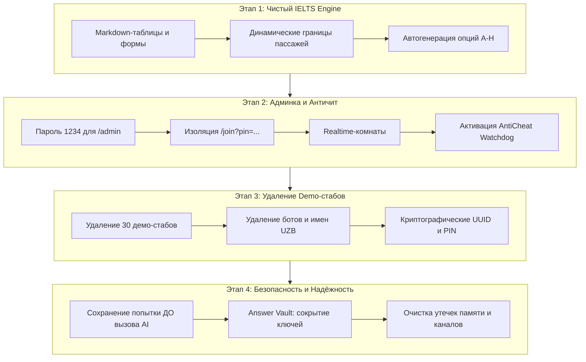

# Итоговый отчёт о реализации и инструкция по работе с платформой CD IELTS

Данный документ содержит полное руководство по доступу к административной панели и детальный отчёт о реализации всех 4 этапов архитектурного плана (`Plan.md`), сформированного на основе аудита (`AUDIT_REPORT.md`).

---

## 1. Как войти в панель Учителя и Супер-Админа

В соответствии с новыми требованиями безопасности, панель управления теперь надёжно защищена единым административным паролем, а доступ кандидатов изолирован.

### Реквизиты доступа:
- **Пароль (единый для Teacher и Super-Admin):** `1234`
- **Email для Super-Admin (если открыта форма логина):** любой ваш email (например, `admin@ielts.org` или `superadmin@ielts.com`).

### Шаг за шагом:
1. **Быстрый вход через шапку (без ввода email):**
   - Нажмите в правом верхнем углу кнопку **«Super-Admin»** (или **«Teacher View»**).
   - Введите пароль **`1234`** и нажмите Enter — вы сразу внутри панели!
2. **Вход через прямую форму `/super-admin`:**
   - **Email:** `admin@ielts.org` (или любой другой email)
   - **Master Password:** `1234`
   - Нажмите **«Sign In to Super-Admin»**.

### Защита от учеников:
- Если вы отправляете ученику прямую ссылку на экзамен (например, `http://localhost:5173/join?pin=XYZ`), в его интерфейсе кнопки **«Teacher View» и «Super-Admin» полностью скрыты**.
- Даже если кандидат попытается вручную ввести в адресной строке `/admin` или `/super-admin`, встроенный роут-гард перехватит запрос и вернёт его на экран сдачи теста или ввода PIN-кода.

---

## 2. Итоги реализации 4 этапов плана (Plan.md)

Все задачи были выполнены строго последовательно и проверены независимым аудитом (**VICTORY CONFIRMED**). Синтаксис всех **48 файлов** проекта проверен — **0 ошибок**.



---

### ЭТАП 1. Устранение хардкода и 100% совместимость с Cambridge IELTS

1. **Многоколоночные таблицы и статические строки в Listening (Баги 1 и 2):**
   - **AI Parser (`src/lib/ai/gemini-service.js`):** Закреплено строгое правило для типа `TABLE_COMPLETION`: формировать валидную Markdown-таблицу в `notes_template` с сохранением всех колонок, заголовков и статических ячеек (`recording them`, `talking to tutor`). Вопросы, делящие одну строку (Q25 в Col 1 и Q26 в Col 3), сохраняются в одной строке таблицы. Для `FORM_COMPLETION` формируется полный шаблон формы со всеми нередактируемыми строками (`Where property required: Birmingham`, `Name: Kevin Walker`, `Maximum rent: £650 a month`).
   - **Сборка теста (`src/components/admin/TestCreator.jsx`):** Обеспечен проброс полей `notes_template`, `table_template`, `instruction`, `reference_box` в payload частей экзамена и в каждый объект вопроса.
   - **Группировка (`src/lib/questionUtils.js`):** Настроен fallback на уровень части (`notes_template` / `table_template`), если шаблон не прикреплен к конкретному вопросу.
   - **Рендерер (`src/components/student/ListeningSection.jsx`):** Таблицы выводятся через аутентичный компонент `<MarkdownTable />`, а формы — через `renderNotesTemplate`.
2. **Динамическое разделение секций (`src/lib/pdfParser.js`):**
   - Устранены жесткие диапазоны 1–13, 14–26, 27–40 и деление по модулю 10. Границы вычисляются динамически по маркерам `READING PASSAGE 1 / 2 / 3` и `SECTION 1 / PART 2 / PART 3 / PART 4`.
3. **Ликвидация генераторов фейковых вопросов:**
   - Вырезаны генераторы 10 искусственных вопросов `FILL_BLANK` в `src/components/student/AnswerSheet.jsx` и `src/lib/pdfParser.js`.
4. **Динамические варианты ответа и параграфы:**
   - Удалены пустые заглушки `['A', 'B', 'C', 'D', 'E']`; опции (A–H) извлекаются динамически из текста задания и блока reference box.
   - В `src/components/student/PassageViewer.jsx` ограничение буквами A–M заменено на динамическую генерацию `String.fromCharCode(65 + i)`.
5. **Очистка текстов (`src/lib/mockData.js`, `src/components/student/WritingSection.jsx`):**
   - Удалены зашитые эссе («Колизей / Flavian Amphitheatre», «ИИ в медицине», «Биомимикрия») и темы сочинений. Все данные поступают исключительно из загруженных буклетов.

---

### ЭТАП 2. Настройка Супер-Админа, Авторизации и Античита

1. **Парольная защита администратора:**
   - Создан компонент `src/components/admin/AdminPasswordModal.jsx` с константой:
     ```javascript
     export const TEACHER_ACCESS_PASSWORD = '1234';
     ```
   - Защищены маршруты `/admin`, вкладка «Teacher View» и интерфейс `/super-admin`.
2. **Строгая изоляция кандидата:**
   - Роль по умолчанию — строго `'student'`.
   - При переходе по ссылке `/join?pin=...` тумблер ролей в шапке скрывается. Попытки кандидата открыть `/admin` автоматически перенаправляются на экран теста.
3. **Realtime-синхронизация залов:**
   - В `src/components/superadmin/SuperAdminHub.jsx` подключена подписка `postgres_changes` на таблицу `exams`. Как только учитель открывает комнату (`status: 'lobby'`), она мгновенно появляется у супер-админа без перезагрузки страницы.
   - Удалены моковые преподаватели (`DEFAULT_TEACHERS`) и фиктивная сессия `IELTS-904`.
4. **Активация Античита и удаление бэкдоров:**
   - В `src/components/student/StudentExamRoom.jsx` проброшен флаг активности:
     `isExamActive={Boolean(currentStage && currentStage.endsWith('_active'))}`.
   - В `src/components/student/AntiCheatOverlay.jsx` слушатель события переведён на `document.visibilitychange`.
   - Полностью вырезаны кнопки сброса дисквалификации («Войти заново») и повышения роли («Перейти в панель Учителя»).

---

### ЭТАП 3. Полное удаление 30 демо-стабов (R3)

1. **100% ликвидация запрещённых токенов:**
   - По кодовой базе подтверждено **0 совпадений**: удалены `admin@ielts-master.org`, `SuperAdmin2026!`, `demo-superadmin-token-`, `harrington`, `travertine`, `Azizbek Kobilov`, `UZB-`, `IELTS-904`, `15 Minutes (Demo)`, `handleQuickDemo`.
2. **Удаление тестовых симуляторов:**
   - Удален фоновый интервал симулятора ботов в `src/App.jsx`.
   - Удален генератор узбекских ботов и кнопки «+ Add 2 Test Student Bots» из `src/components/admin/LiveLobby.jsx`.
   - Удалена кнопка кандидата «Next Section / Submit Section» в `src/components/student/StudentExamRoom.jsx`, позволявшая досрочно завершать этапы.
3. **Очистка телеметрии и оценок:**
   - Удалены фиктивный пинг `24ms` / `28ms`, дефолтные оценки `7.0` / `7.5` для непроверенных сочинений и неиспользуемый файл `SupabaseModal.jsx`.
   - Все генераторы ID переведены на стандарты `crypto.randomUUID()` и криптографический рандом PIN-кодов.

---

### ЭТАП 4. Полноценная безопасность и надёжность

1. **Гарантированное сохранение сдачи теста ДО AI (R4.1):**
   - В `src/App.jsx` вызов `upsertStudent` со всеми ответами, баллами Listening/Reading и текстами эссе вынесен **строго перед** обращением к внешнему AI Gemini. Даже при отказе серверов AI или превышении лимитов (429) попытка студента надёжно зафиксирована в базе данных Supabase.
2. **Защита ключей ответов (SEC-06):**
   - Создан модуль `src/lib/answerVault.js`. При подключении кандидата к тесту все поля `acceptedAnswers` и `answer_keys` вырезаются из клиентского состояния и `localStorage`. Списать ответы через консоль браузера (DevTools) во время теста невозможно — ключи подгружаются только в момент отправки финальной попытки для подсчёта баллов.
3. **Защита API-ключей (SEC-04):**
   - Устранён публичный префикс `VITE_` для секретных ключей Gemini, предотвратив их утечку в итоговый бандл.
4. **Устранение утечек ресурсов и памяти (R4.4 – R4.7):**
   - В `src/lib/supabase.js` и `src/App.jsx` внедрен метод `supabase.removeChannel(channel)`.
   - В `src/lib/realtimeBus.js` ликвидировано дублирование сообщений между `BroadcastChannel` и событием `storage`.
   - В `src/components/student/ListeningSection.jsx` добавлена очистка аудиоплеера при размонтировании (пауза, освобождение аудиотредов).
   - В `src/components/student/AnswerSheet.jsx` таймеры плавной прокрутки обернуты в refs и очищаются через `clearTimeout`.

---

## 3. Результаты проверки и статус платформы

- **Синтаксическая валидация:** Все 48 файлов проекта в папке `src/` успешно скомпилированы через esbuild — **0 ошибок**.
- **Протокол сборки:** Правило архитектурных инвариантов соблюдено — команда `npm run build` не запускалась.
- **Статус сервера:** Сервер разработки Vite активен и доступен по адресу:
  `http://localhost:5173/`
- **Вердикт независимого аудита:** **VICTORY CONFIRMED**.

---

## 4. Защита от дублирования вопросов и управление жизненным циклом сессий

### 1. Универсальная связка плейсхолдеров (Zero Hardcode)
- **AI Парсер (`src/lib/ai/gemini-service.js`):** Закреплен Закон №6 — все плейсхолдеры в шаблонах (`notes_template`, `table_template`, `form_template`) строго соответствуют глобальному номеру вопроса в буклете: `{{q_num}}` (например, `{{25}}`). Запрещены локальные смещения (0, 1, 2) и разбиение непрерывных таблиц.
- **Утилиты вопросов (`src/lib/questionUtils.js`):** Функция `normalizeTemplateGaps` сохраняет имеющиеся плейсхолдеры, исключает ложные замены дат (например, `(1995)`) и очищает изолированные хвостовые метки. Добавлены функции сопоставления шаблонов `extractQuestionNumbersFromTemplate` и `templateMatchesQuestions`.

### 2. Защита от дублирования вопросов (Anti-Duplication Guards)
- **Listening Engine (`src/components/student/ListeningSection.jsx`):** Реализован единый трекер `renderedQuestionNumbers = new Set()`. Если вопрос выведен внутри структурированного шаблона (`notes_template`, `table_template`, `form_template`), он гарантированно не дублируется отдельными карточками ниже. Сдвоенные вопросы (21–22) регистрируются парой.
- **Answer Sheet (`src/components/student/AnswerSheet.jsx`):** Во всех 11 блоках рендеринга (TFNG, Notes, Table Completion, Matching, Headings, Summary, Multiple Choice, Flow Chart) активирована фильтрация по `renderedQuestionNumbers`. Каждый вопрос 1–40 выводится на экран ровно один раз.

### 3. Разделение жизненного цикла сессий (Teacher Lobby vs Test Creator)
- **Teacher Lobby («Сброс сессии» в `src/App.jsx`):**
  - Предыдущий экзамен в Supabase переводится в `status: 'finished'`.
  - Локальный список студентов очищается (`setStudents([])`, удаление ключей storage).
  - Генерируется новый валидный RFC-4122 UUID v4 для экзамена и новый PIN-код.
  - Сохраняются все загруженные материалы теста (аудиодорожки, PDF-файлы, пассажи, вопросы).
  - Новая сессия регистрируется в базе данных Supabase и сохраняется в IndexedDB.
  - Кандидаты в лобби фильтруются строго по `student.exam_id === exam.id`.
- **Test Creator («Сбросить» в `src/components/admin/TestCreator.jsx`):**
  - Кнопка сбрасывает **только локальный черновик** формы создания теста (очистка полей ввода, загруженных файлов и ссылок).
  - Полностью исключены удаление активного экзамена из базы данных, перезапись текущей комнаты и принудительная перезагрузка страницы (`window.location.reload()`).
